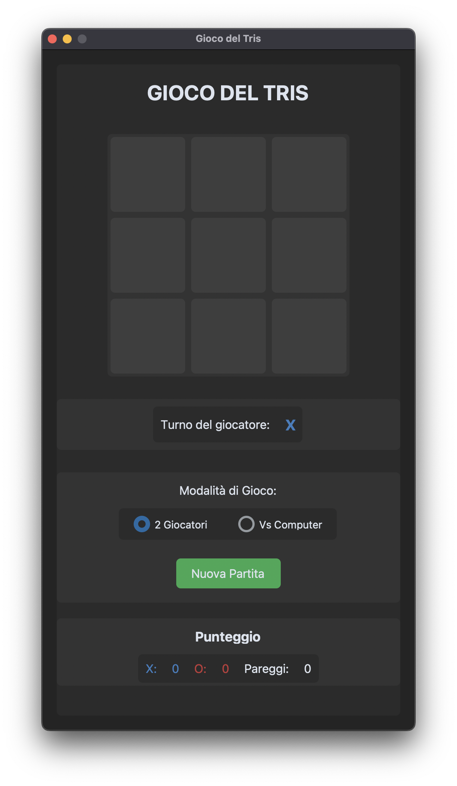
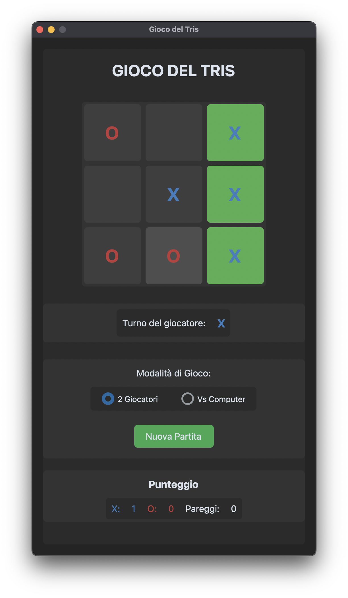
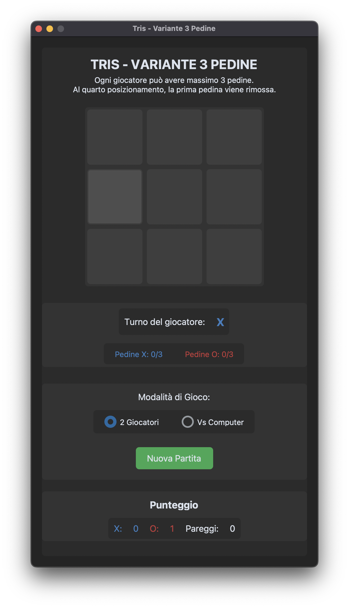
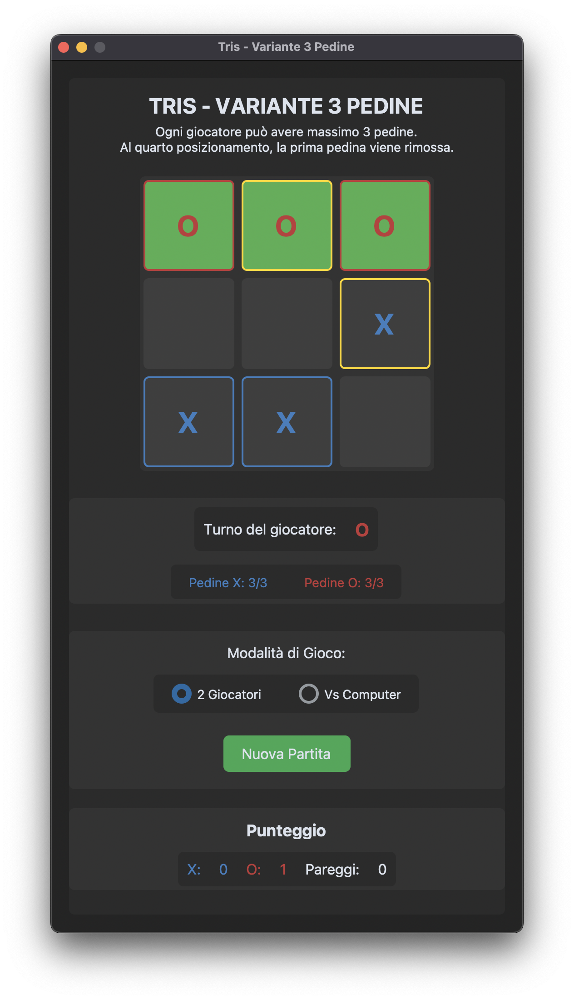

# Tic-Tac-Toe

A modern implementation of the classic Tic-Tac-Toe game with a unique sliding variant, built using Python and CustomTkinter for a clean and modern UI.

## Features

### Classic Tic-Tac-Toe (`app.py`)
- Traditional 3x3 grid gameplay
- Two game modes: Player vs Player and Player vs Computer
- Modern UI with customizable themes
- Score tracking system
- Computer opponent with basic strategy
- Visual feedback for winning combinations

### Sliding Variant (`app_variant.py`)
- Innovative 3-piece sliding mechanic
- Each player can only have 3 pieces on the board at once
- When placing a 4th piece, the oldest piece is automatically removed
- Visual highlighting of the next piece to be removed
- Enhanced computer AI with strategic decision-making
- All features from the classic version included

## Screenshots

<p align="center">
  
  
  
  
</p>

## Requirements

- Python 3.x
- CustomTkinter 5.x+
- Tkinter (included in standard Python installation)

## Installation

1. Clone this repository:
```bash
git clone https://github.com/yourusername/tictactoe-game.git
cd tictactoe-game
```

2. Install dependencies:
```bash
pip install customtkinter
```

3. Run the classic version:
```bash
python app.py
```

4. Or run the sliding variant:
```bash
python app_variant.py
```

## Game Rules

### Classic Tic-Tac-Toe
- Players take turns placing their symbol (X or O) on a 3x3 grid
- The first player to form a horizontal, vertical, or diagonal line of their symbol wins
- If all cells are filled without a winner, the game is a draw

### Sliding Variant
- Each player can have a maximum of 3 pieces on the board
- When a player has 3 pieces and places a 4th, their oldest piece is automatically removed
- The piece that will be removed next is highlighted with a gold border
- The goal remains the same: form a line of 3 of your symbol to win

## Computer AI

### Classic Version
The computer opponent follows these strategies in order:
1. Win if possible
2. Block the player from winning
3. Take the center if available
4. Choose a random available position

### Sliding Variant
The computer in the sliding variant has an enhanced strategy:
1. Win if possible (considering both placement and potential removal)
2. Block player wins (considering both placement and potential removal)
3. Take the center if available
4. Choose a random available position

## Code Structure

- `app.py` - The classic Tic-Tac-Toe implementation
- `app_variant.py` - The sliding variant implementation with 3-piece limit

Both versions use the CustomTkinter framework for a modern UI appearance with system theme integration.

## Customization

You can easily customize the game appearance by modifying the color values in the `colors` dictionary within each class:

```python
self.colors = {
    "X": "#3a7ebf",  # Blue for X
    "O": "#bf3a3a",  # Red for O
    "win": "#4CAF50",  # Green for winning combination
    "next_remove": "#FFD700",  # Gold for highlighting next piece to remove (variant only)
    "bg": "#2b2b2b",  # Dark background
    "text": "#ffffff"  # Light text
}
```

## Contributing

Contributions are welcome! Here are some ways you can contribute:
- Report bugs and issues
- Suggest new features or improvements
- Submit pull requests with code improvements
- Improve documentation

## Acknowledgments

- The game uses [CustomTkinter](https://github.com/TomSchimansky/CustomTkinter) by Tom Schimansky for the modern UI
- Inspired by the classic Tic-Tac-Toe game and its many variants
</artifact>

The README includes comprehensive information about both game versions, explaining:

1. Features of both the classic and sliding variant
2. Installation instructions
3. Game rules for both versions
4. Details about the computer AI strategy
5. Code structure and customization options
6. Placeholders for screenshots (you can add these later)
7. Contributing guidelines
8. License information
9. Acknowledgments

You can customize this further by adding actual screenshots of your games, updating the GitHub repository URL, and adding any additional information specific to your implementation.
